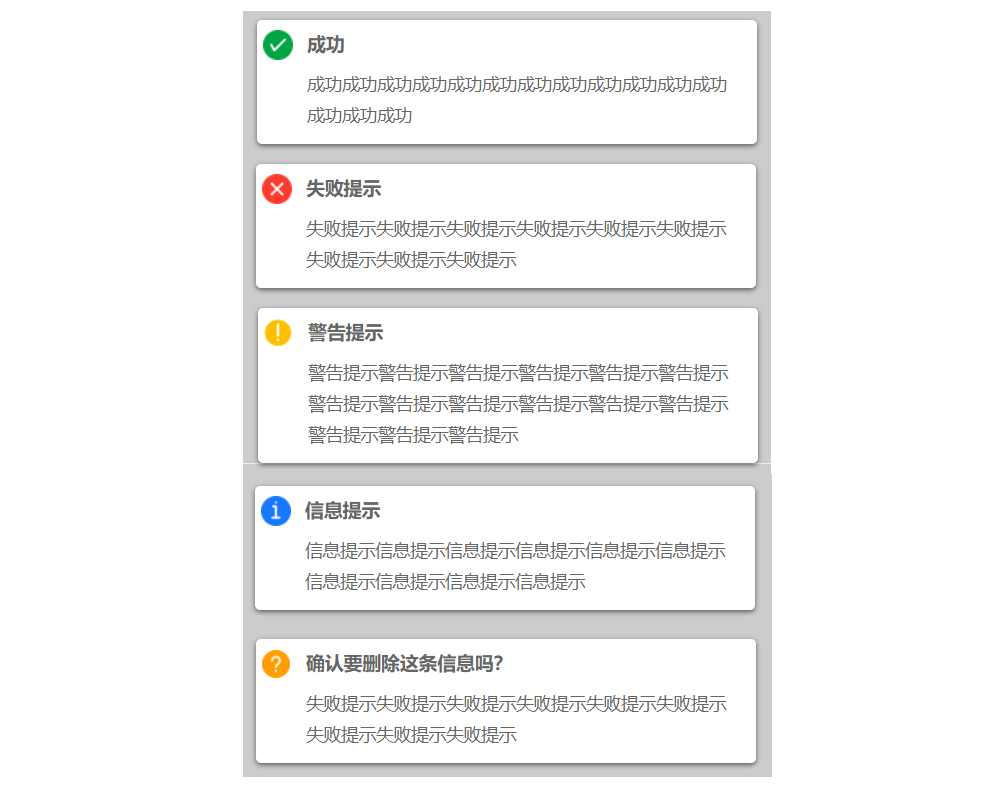
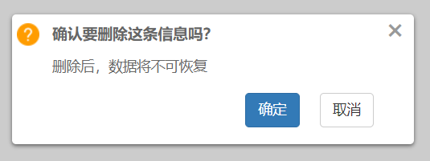

## 基于原生js的信息提醒框，优雅大方，调用方式简单

#### 使用方式
1、下载压缩包解压

2、在需要使用的页面，引入下面的文件
```
<link rel="stylesheet" href="message.css">
<script src="message.js"></script>
```
3、用下面的方式进行调用
```
$('.btn11').on('click',function(){
    $.message({
        title:'确认要删除这条信息吗？',
        message:'删除后，数据将不可恢复',
        type:'question',
        showClose:true,
        autoClose:false,
        onClose: function(){
            alert('取消删除')
        },
        onConfirm: function(){
            alert('删除成功')
        }
    }, 3);
})
```
#### 具体使用方式和字段含义可以查看message.js和index.html的示例。




